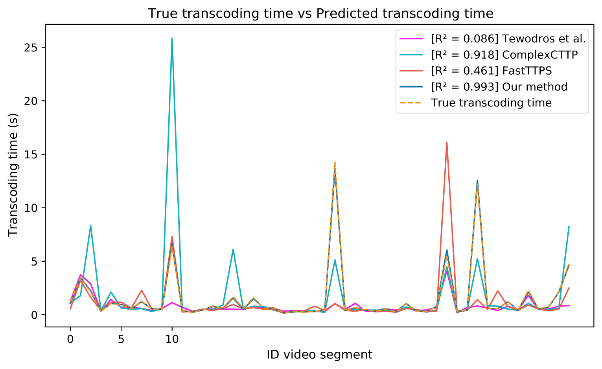

# Video transcoding time prdection (VTTP)
Video transcoding time prdection (VTTP) is an efficient prediction model based on machine learning for predicting the transcoding times of video segments with short time (2 and 4 seconds) and encoded with multiple video codecs (H.264/AVC and H.265/HEVC). The prediction model is able to predict accurately the transcoding time for different video format (resolution, bitrate, framerate, codec, preset) and for  different type of platform (CPU and GPU)

## Install 


```bash
git clone https://github.com/chachoutaieb/VTTP.git
pip3 install -r requirements.txt

```

## Download Dataset

- [x] [Our dataset with all calculated features](https://drive.google.com/uc?export=download&id=1Trp7JikrirT1KKQzbo6BI1XWXHMQfxV3)
- [x] [Our dataset with selected features](https://drive.google.com/uc?export=download&id=10VDjv4lGbn2eDVUa9HwnV-wDz4cThawX)
- [x] [Zabrovskiy et al. dataset with all calculated features ](https://drive.google.com/uc?export=download&id=1F-FgxRixdASDvoshr1Dj5rw-WYhiXKuk)
- [x] [Zabrovskiy et al. dataset with selected features](https://drive.google.com/uc?export=download&id=1dMWNXPSrjobT4GTmoUdaRTMvcYQMVfy4)


Note : make all the downloaded dataset in the dataset directory


## Usage

### 1. Performace evaluation of XGBoost model with other machine learning model

```bash

python3 '/your-path-to-the-project/Predection_Treanscoding_Time_Algorithm.py' \
-p '/your-path-to-the-project' \
-o 'all_method' 

# you will see

+---------------------------------+-----------------------------------------------------------------------------------+
|             Dataset             |                                      SVD_NVD                                      |
+---------------------------------+---------------------------+---------------------------+---------------------------+
|             Metric              |            R2             |           RMSE            |            MAE            |
+----------+----------------------+---------------------------+---------------------------+---------------------------+
| Platform |      Algorithm       |   ALL     H.264    H.265  |   ALL     H.264    H.265  |   ALL     H.264    H.265  |
+----------+----------------------+---------------------------+---------------------------+---------------------------+
|          |       XGBoost        | 0.9943   0.9939   0.9942  | 0.9671   0.2569   1.3461  | 0.1568   0.0612   0.2532  |
+          +----------------------+---------------------------+---------------------------+---------------------------+
|   CPU    |       LightGBM       | 0.9923   0.9914   0.9922  | 1.1236   0.3066   1.5623  | 0.2157   0.1084   0.3238  |
+          +----------------------+---------------------------+---------------------------+---------------------------+
|          |         ANN          | 0.9840   0.9801   0.9837  | 1.6244   0.4657   2.2541  | 0.3078   0.1096   0.5076  |
+          +----------------------+---------------------------+---------------------------+---------------------------+
|          |         KNN          | 0.9519   0.9704   0.9501  | 2.8115   0.5681   3.9434  | 0.3580   0.0787   0.6397  |
+----------+----------------------+---------------------------+---------------------------+---------------------------+
|          |       XGBoost        | 0.9914   0.9929   0.9902  | 0.0414   0.0350   0.0470  | 0.0221   0.0197   0.0245  |
+          +----------------------+---------------------------+---------------------------+---------------------------+
|   GPU    |       LightGBM       | 0.9884   0.9891   0.9877  | 0.0482   0.0433   0.0526  | 0.0287   0.0270   0.0304  |
+          +----------------------+---------------------------+---------------------------+---------------------------+
|          |         ANN          | 0.9555   0.9584   0.9525  | 0.0944   0.0845   0.1033  | 0.0431   0.0428   0.0435  |
+          +----------------------+---------------------------+---------------------------+---------------------------+
|          |         KNN          | 0.9783   0.9775   0.9786  | 0.0659   0.0621   0.0694  | 0.0329   0.0362   0.0295  |
+----------+----------------------+---------------------------+---------------------------+---------------------------+
|          |       XGBoost        | 0.9944    0.994   0.9943  | 0.8378   0.2234   1.1649  | 0.1231   0.0509   0.1957  |
+          +----------------------+---------------------------+---------------------------+---------------------------+
| CPU+GPU  |       LightGBM       | 0.9924   0.9914   0.9923  | 0.9734   0.2667   1.3520  | 0.1689   0.0882   0.2501  |
+          +----------------------+---------------------------+---------------------------+---------------------------+
|          |         ANN          | 0.9841   0.9801   0.9839  | 1.4077   0.4059   1.9511  | 0.2416   0.0930   0.3910  |
+          +----------------------+---------------------------+---------------------------+---------------------------+
|          |         KNN          | 0.9524   0.9706   0.9509  | 2.4352   0.4934   3.4122  | 0.2768   0.0682   0.4863  |
+----------+----------------------+---------------------------+---------------------------+---------------------------+
|             Dataset             |                                 Zabrovskiy et al.                                 |
+---------------------------------+---------------------------+---------------------------+---------------------------+
|          |       XGBoost        | 0.9895   0.9946   0.9877  | 6.1444   3.0499   8.0962  | 1.8422   1.0087   2.6565  |
+          +----------------------+---------------------------+---------------------------+---------------------------+
|   CPU    |       LightGBM       | 0.9882    0.991   0.9871  | 6.5156   3.9439   8.2904  | 2.3123   1.5249   3.0816  |
+          +----------------------+---------------------------+---------------------------+---------------------------+
|          |         ANN          | 0.9636   0.9721   0.9604  | 11.4211  6.9556   14.5123 | 3.4283   2.1365   4.6902  |
+          +----------------------+---------------------------+---------------------------+---------------------------+
|          |         KNN          | 0.9085   0.8987   0.9103  | 18.1071  13.2460  21.8347 | 5.2590   3.2396   7.2316  |
+----------+----------------------+---------------------------+---------------------------+---------------------------+


```
### 2 . Performance evaluation of our proposed method  on different dataset

```bash

python3 '/your-path-to-the-project/Predection_Treanscoding_Time_Dataset.py' \
-p '/your-path-to-the-project' \
-o 'all_method' 

# you will see

+---------------------------------+---------------------------+---------------------------+---------------------------+
|             Metric              |            R2             |           RMSE            |            MAE            |
+----------------------+----------+---------------------------+---------------------------+---------------------------+
|       Dataset        | Platform |   ALL     H.264    H.265  |   ALL     H.264    H.265  |   ALL     H.264    H.265  |
+----------------------+----------+---------------------------+---------------------------+---------------------------+
|                      |   CPU    | 0.9987    0.996   0.9987  | 0.1725   0.0493   0.2393  | 0.0627   0.0264   0.0992  |
+                      +----------+---------------------------+---------------------------+---------------------------+
|         SVD          |   GPU    | 0.9808   0.9744   0.9825  | 0.0248   0.0228   0.0267  | 0.0169   0.0155   0.0184  |
+                      +----------+---------------------------+---------------------------+---------------------------+
|                      | CPU+GPU  | 0.9987   0.9958   0.9987  | 0.1500   0.0442   0.2079  | 0.0513   0.0237   0.0791  |
+----------------------+----------+---------------------------+---------------------------+---------------------------+
|                      |   CPU    | 0.9907   0.9944   0.9903  | 2.9982   0.4624   4.1925  | 0.5630   0.1457   0.9714  |
+                      +----------+---------------------------+---------------------------+---------------------------+
|         NVD          |   GPU    | 0.9911   0.9919   0.9902  | 0.0764   0.0687   0.0833  | 0.0394   0.0341   0.0447  |
+                      +----------+---------------------------+---------------------------+---------------------------+
|                      | CPU+GPU  | 0.9909   0.9947   0.9905  | 2.5975   0.4015   3.6368  | 0.4323   0.1176   0.7419  |
+----------------------+----------+---------------------------+---------------------------+---------------------------+
|                      |   CPU    | 0.9930   0.9937   0.9928  | 1.1289   0.2144   1.5821  | 0.1624   0.0582   0.2666  |
+                      +----------+---------------------------+---------------------------+---------------------------+
|       SVD+NVD        |   GPU    | 0.9906   0.9927   0.9890  | 0.0433   0.0338   0.0510  | 0.0221   0.0193   0.0248  |
+                      +----------+---------------------------+---------------------------+---------------------------+
|                      | CPU+GPU  | 0.9931   0.9938   0.9929  | 0.9773   0.1864   1.3691  | 0.1272   0.0485   0.2058  |
+----------------------+----------+---------------------------+---------------------------+---------------------------+
|  Zabrovskiy et al.   |   CPU    | 0.9884   0.9941   0.9866  | 6.7087   3.1179   9.0022  | 1.9089   1.0497   2.7862  |
+----------------------+----------+---------------------------+---------------------------+---------------------------+

```
### 3. Performance evaluation of our proposed method with other existing methods

```bash

python3 '/your-path-to-the-project/Predection_Treanscoding_Time.py' \
-p '/your-path-to-the-project' \
-o 'all_method' -ds 'SVD_NVD' 'Zabrovskiy et al.'

# you will see

+---------------------------------+-----------------------------------------------------------------------------------+
|             Dataset             |                                      SVD_NVD                                      |
+---------------------------------+---------------------------+---------------------------+---------------------------+
|             Metric              |            R2             |           RMSE            |            MAE            |
+----------+----------------------+---------------------------+---------------------------+---------------------------+
| Platform |      Algorithm       |   ALL     H.264    H.265  |   ALL     H.264    H.265  |   ALL     H.264    H.265  |
+----------+----------------------+---------------------------+---------------------------+---------------------------+
|          |   Tewodros et al.    | 0.0817   0.4127   0.0492  | 12.2476  2.3689   17.1188 | 2.2332   0.4802   3.9699  |
+          +----------------------+---------------------------+---------------------------+---------------------------+
|   CPU    |     ComplexCTTP      | 0.9269    0.911   0.9256  | 3.4562   0.9223   4.7892  | 1.1107   0.3658   1.8487  |
+          +----------------------+---------------------------+---------------------------+---------------------------+
|          |       FastTTPS       | 0.4566   -1.272   0.4965  | 9.4216   4.6595   12.4579 | 2.0373   0.7329   3.3295  |
+          +----------------------+---------------------------+---------------------------+---------------------------+
|          |      Our method      | 0.9927   0.9944   0.9924  | 1.0957   0.2322   1.5286  | 0.1545   0.0585   0.2496  |
+----------+----------------------+---------------------------+---------------------------+---------------------------+
|          |   Tewodros et al.    | -9.4701  -4.716  -13.2817 | 1.4420   0.9910   1.7781  | 0.4946   0.3520   0.6352  |
+          +----------------------+---------------------------+---------------------------+---------------------------+
|   GPU    |     ComplexCTTP      |-23.3005  -6.146  -36.8327 | 2.1968   1.1080   2.8940  | 0.4310   0.3044   0.5559  |
+          +----------------------+---------------------------+---------------------------+---------------------------+
|          |       FastTTPS       | 0.1067   -0.2454  0.3615  | 0.4212   0.4626   0.3760  | 0.1264   0.1159   0.1367  |
+          +----------------------+---------------------------+---------------------------+---------------------------+
|          |      Our method      | 0.9896   0.9925   0.9872  | 0.0454   0.0359   0.0532  | 0.0223   0.0198   0.0248  |
+----------+----------------------+---------------------------+---------------------------+---------------------------+
|          |   Tewodros et al.    | 0.0863   0.3873   0.0604  | 10.6472  2.1135   14.8704 | 1.8025   0.4485   3.1425  |
+          +----------------------+---------------------------+---------------------------+---------------------------+
| CPU+GPU  |     ComplexCTTP      | 0.9179   0.8705   0.9179  | 3.1909   0.9715   4.3959  | 0.9423   0.3506   1.5279  |
+          +----------------------+---------------------------+---------------------------+---------------------------+
|          |       FastTTPS       | 0.4614   -1.249   0.5040  | 8.1745   4.0490   10.8040 | 1.5639   0.5803   2.5373  |
+          +----------------------+---------------------------+---------------------------+---------------------------+
|          |      Our method      | 0.9927   0.9944   0.9925  | 0.9506   0.2023   1.3257  | 0.1218   0.0489   0.1938  |
+----------+----------------------+---------------------------+---------------------------+---------------------------+
|             Dataset             |                                 Zabrovskiy et al.                                 |
+---------------------------------+---------------------------+---------------------------+---------------------------+
|          |   Tewodros et al.    | 0.0503    0.238   -0.0171 | 60.6967  35.9172  77.4420 | 19.8081  12.3272  27.0362 |
+          +----------------------+---------------------------+---------------------------+---------------------------+
|   CPU    |     ComplexCTTP      | 0.9302   0.9274   0.9299  | 16.4536  11.0894  20.3340 | 5.1870   3.5794   6.7402  |
+          +----------------------+---------------------------+---------------------------+---------------------------+
|          |       FastTTPS       | 0.7862   0.8233   0.7724  | 28.7995  17.2951  36.6304 | 9.4776   5.8715   12.9620 |
+          +----------------------+---------------------------+---------------------------+---------------------------+
|          |      Our method      | 0.9883   0.9946   0.9864  | 6.7315   3.0136   8.9622  | 1.9691   1.0322   2.8744  |
+----------+----------------------+---------------------------+---------------------------+---------------------------+
```
 

